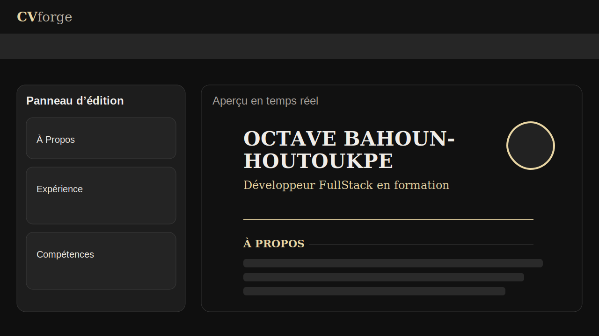
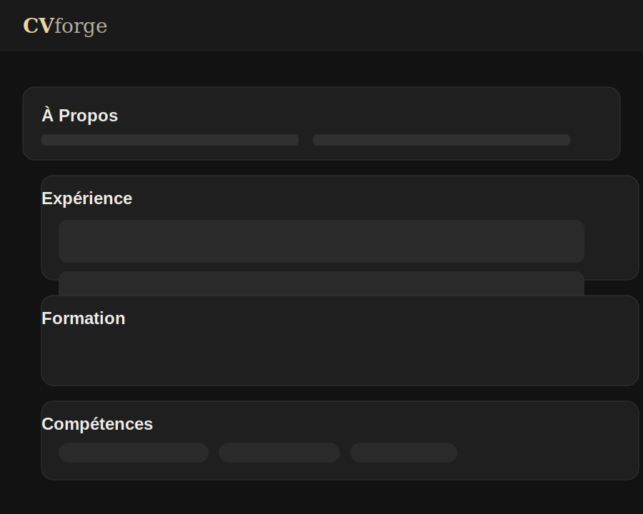
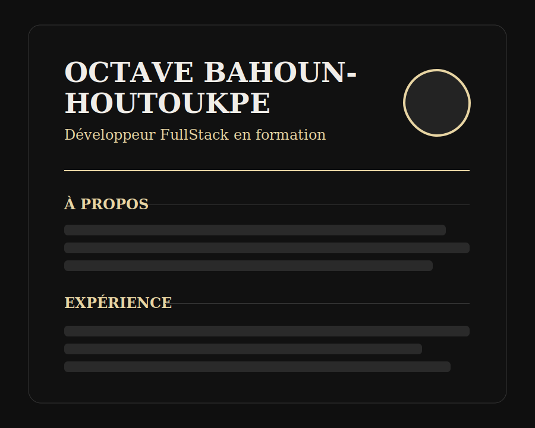

# CV Generator


Générateur de CV et portfolio en HTML avec aperçu en temps réel, thèmes visuels, mises en page multiples et assistance IA via OpenRouter.

## Demo

- Démo en ligne : `https://cv-generator-nine-orcin.vercel.app`
- Lancement local : ouvrir `index.html` dans le navigateur

## Aperçu

Cette application permet de créer rapidement un CV moderne directement dans le navigateur, sans build ni dépendances locales.

Fonctionnalités principales :

- édition en direct des informations personnelles ;
- gestion des sections `À propos`, `Expérience`, `Formation`, `Compétences` et `Projets` ;
- aperçu temps réel du CV ;
- 3 mises en page : `Standard`, `Sidebar`, `Centré` ;
- 4 thèmes : `dark`, `minimal`, `creative`, `classic` ;
- export du CV en fichier HTML ;
- génération et amélioration de contenu avec OpenRouter.

## Captures d’écran

### Vue globale



### Panneau d’édition



### Aperçu du CV



## Fichiers principaux

- `index.html` : application principale ;
- `docs/screenshots/` : visuels utilisés dans le README ;
- `README.md` : documentation du projet.

## Lancer le projet

Aucune installation n’est nécessaire.

### Option 1 — ouverture directe

Ouvre simplement `index.html` dans ton navigateur.

### Option 2 — serveur local

Tu peux aussi lancer un serveur statique local :

```bash
python3 -m http.server 8000
```

Puis ouvrir :

```text
http://localhost:8000
```

## Utilisation

1. Remplir les champs dans le panneau de gauche.
2. Ajouter des expériences, formations, compétences et projets.
3. Choisir une mise en page en haut de l’interface.
4. Choisir un thème visuel.
5. Vérifier le rendu dans l’aperçu à droite.
6. Exporter le CV avec le bouton `Exporter HTML`.

## Utilisation de l’IA

L’application peut utiliser OpenRouter pour générer ou améliorer certaines parties du CV.

### Prérequis

- disposer d’une clé API OpenRouter ;
- la coller dans le champ `OPENROUTER API KEY`.

### Ce que fait l’IA

- génération du résumé personnel ;
- amélioration des expériences ;
- amélioration des formations ;
- suggestion de compétences ;
- amélioration des projets ;
- génération globale avec `Tout générer avec Kimi`.

Le modèle actuellement référencé dans l’interface est :

- `moonshotai/kimi-k2`

## Export

L’export génère un fichier HTML autonome du CV courant, incluant le style nécessaire à l’affichage.

## Responsive

L’interface s’adapte aussi aux écrans plus petits :

- sur mobile, l’éditeur et l’aperçu sont séparés par des onglets ;
- la mise en page `Sidebar` se réorganise automatiquement.

## Personnalisation

Tu peux modifier facilement dans `index.html` :

- les couleurs via les variables CSS dans `:root` ;
- les tailles et espacements des blocs ;
- les mises en page du CV ;
- les prompts envoyés à l’IA ;
- le modèle OpenRouter utilisé.

## Limites actuelles

- aucune persistance locale : un rechargement de page réinitialise les données ;
- l’export est en HTML uniquement ;
- les appels IA nécessitent une connexion réseau et une clé OpenRouter valide.

## Roadmap

- [ ] Ajouter la sauvegarde locale avec `localStorage`
- [ ] Proposer un export PDF
- [ ] Permettre la réorganisation des sections par glisser-déposer
- [ ] Ajouter d’autres templates de CV
- [ ] Améliorer la validation des URLs et des champs
- [ ] Ajouter un système d’import/export des données utilisateur

## Idées d’amélioration

- prévisualisation de plusieurs variantes générées ;
- personnalisation plus fine des polices ;
- duplication rapide d’expériences et de projets ;
- mode impression optimisé.
